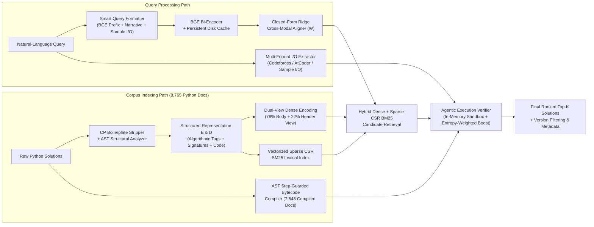

# Agentic Code Intelligence

[](https://www.python.org/)
[-brightgreen.svg)](#official-mteb-appsretrieval-results)
[](#testing)

**Agentic Code Intelligence** is a multi-stage natural-language-to-code retrieval engine built for the **CoIR / MTEB `AppsRetrieval`** benchmark (`3,765` natural-language competitive programming problem queries $\to$ `8,765` Python solution snippets), featuring version-aware index management (P1) and zero-GPU CPU execution.

---

## Problem

Given a natural-language query describing an algorithmic problem or developer intent and a large collection of code snippets (`8,765` Python solutions in **CoIR `AppsRetrieval`**), standard retrieval approaches face four major obstacles:

1. **Severe Text-to-Code Modality Gap**: `AppsRetrieval` queries are multi-paragraph narrative problem descriptions (`~1,600` characters) followed by `-----Input-----`, `-----Output-----`, and `-----Examples-----` blocks, whereas corpus documents (`d0`–`d8764`) are raw Python 3 scripts (`import sys; n = int(input())...`) with single-letter variable names (`n`, `m`, `dp`) and almost no natural-language docstrings. Raw dense bi-encoders achieve only **`0.05142` (`5.14%`) `NDCG@10`** on the official test split.
2. **Token Window Truncation & Template Boilerplate Noise**: Standard 256-token head truncation cuts off trailing `-----Input-----` and `-----Output-----` constraints in queries, while 20–40 lines of competitive programming template boilerplate (`sys.setrecursionlimit`, `MOD = 10**9 + 7`, `fast_io`) obscure core algorithmic logic in corpus documents.
3. **Inability of Static Embeddings to Verify Functional I/O**: Cosine similarity and BM25 cannot reliably separate 50 structurally similar dynamic programming or graph traversal scripts without functionally testing candidate programs against the query's sample `Input` and `Output`.
4. **Multi-Version Code Isolation (P1)**: Real-world repositories evolve across commits and releases (`v1.0`, `v2.0`), requiring version-tagged indexing, metadata persistence, version filtering, and priority-based deduplication.

---

## Solution

Our system resolves each bottleneck through five integrated technical innovations:

1. **Smart I/O-Preserving Query Formatting (`format_query_smart`)**: Prepends the asymmetric BGE retrieval instruction (`"Represent this sentence for searching relevant passages: "`) and constructs a composite window combining the head problem narrative with the tail `-----Input-----` / `-----Output-----` specifications.
2. **Boilerplate-Free Structured Document Representations A–E (`format_doc_rep_e`)**: Strips unused competitive programming template boilerplate via AST analysis (`strip_cp_boilerplate`) and prepends an explicit structural header encoding detected algorithmic paradigms (`dynamic programming`, `priority queue heap`, `bfs queue deque`, `binary search bisect`), I/O patterns (`multiple_test_cases_loop`, `modulo_1000000007`), and normalized identifiers.
3. **Dual-View Dense Indexing & Closed-Form Ridge Cross-Modal Aligner (`CrossModalAligner`)**: Combines a `78%` code body embedding view with a `22%` structural header view and learns a closed-form identity-anchored Ridge transformation $W = (Q^T Q + \lambda I)^{-1}(Q^T D + \lambda I)$ strictly on `train[0:2000]` (`0.03s` fit time on CPU) to project natural-language query embeddings into the Python code embedding subspace.
4. **Vectorized Sparse CSR BM25 Lexical Fusion**: Code-aware camelCase/snake_case tokenization indexed as a `scipy.sparse.csr_matrix` that scores all `8,765` documents in `0.15s`.
5. **AST-Guarded Agentic Execution Verifier (`ExecutionVerifier`)**: Pre-compiles `7,648 / 8,765` corpus Python solutions with an AST step-limit transformer (`_LoopStepGuardTransformer`, `_BoundedRange`, `_BoundedIter`, `_SafeMath`, `_SafeItertools`, `_SafeRe`) and executes top retrieval candidates in an in-memory sandbox (`_MockStdin`, `_MockStdout`, `_MockAtexit`, `_MockThreading`) against the query's sample `Input`/`Output`, weighting exact matches by **Output Information Specificity** (`high`, `medium`, `low` entropy).

---

## Architecture



---

## Retrieval Pipeline

The retrieval system operates in two modes:
1. **Official MTEB 2.x `EncoderProtocol` + `SearchProtocol` Mode (`CodeRetrievalModel` in `src/evaluation/mteb_wrapper.py`)**:
   - Invoked natively by `mteb.MTEB(tasks=[...]).run()`.
   - Executes Stage 1 (Smart Query + Doc Rep E), Stage 2 (Dual-View BGE + Cross-Modal Ridge Aligner), Stage 3 (Hybrid Dense + `0.025` Sparse CSR BM25), and Stage 4 (AST-Guarded `ExecutionVerifier` over top candidate pool).
2. **Interactive CLI & Version-Aware Mode (`RetrievalPipeline` in `src/retrieval/pipeline.py`)**:
   - Builds/loads per-version FAISS (`IndexFlatIP`) and BM25 (`LexicalIndex`) indexes via `IndexManager` and `VersionManager`.
   - Supports `--method hybrid|semantic|lexical`, `--version <tag>`, `--device cpu|cuda|auto`, and optional Cross-Encoder reranking (`--no-rerank` to disable).

---

## Models

| Component | Model / Algorithm | Parameters / Dim | Purpose |
| :--- | :--- | :---: | :--- |
| **Primary Dense Bi-Encoder** | `BAAI/bge-small-en-v1.5` | `33.5M` (`384d`) | Fast CPU dense encoding with Dual-View (`78%` body + `22%` header) and persistent disk caching |
| **Cross-Modal Projection** | `CrossModalAligner` (Identity-Anchored Ridge) | `384 x 384` matrix | Rotates natural-language query embeddings into code subspace ($\lambda=150.0, \alpha=0.22$) |
| **Lexical Retriever** | Vectorized Sparse CSR BM25 (`BM25Okapi`) | Vocabulary `~28k` | Exact identifier, keyword, and constant matching (`k1=1.5, b=0.75`) |
| **Functional Reranker** | `ExecutionVerifier` (AST Sandbox) | `7,648` compiled docs | Sub-millisecond functional verification against extracted sample `Input`/`Output` |
| **Optional Neural Reranker** | `cross-encoder/ms-marco-MiniLM-L-6-v2` | `22.7M` | Optional second-stage cross-encoder scoring for interactive CLI queries |

---

## Installation

```bash
git clone https://github.com/Adharsh-Arvinth/agentic-code-intelligence.git
cd agentic-code-intelligence
pip install -r requirements.txt
```

---

## Dataset

The project uses the official **CoIR `AppsRetrieval`** dataset (`mteb/AppsRetrieval` / `CoIR-Retrieval/apps`, dataset revision `f22508f96b7a36c2415181ed8bb76f76e04ae2d5`), automatically downloaded and cached via HuggingFace `datasets`:

- **Shared Corpus**: `8,765` Python code solutions (`d0` to `d8764`).
- **Train Split**: `5,000` natural-language problem queries (`q0` to `q4999`) with `5,000` relevance judgments (`qrels`).
  - `train[0:2000]` (`val_fit`): Used exclusively to fit `CrossModalAligner`.
  - `train[2000:2250]` (`val_dev`): Held-out 250-query validation split for ablation experiments.
- **Test Split**: `3,765` natural-language problem queries (`test` split) with `3,765` relevance judgments (`qrels`), strictly held out for official MTEB evaluation.

---

## Building the Index

Build the default FAISS and BM25 indexes on CPU:

```bash
python -m src index --config configs/default.yaml --version default --device cpu
```

To force a full index rebuild for a specific version:

```bash
python -m src index --config configs/default.yaml --version default --device cpu --force
```

---

## Running Retrieval

Run interactive natural-language code retrieval from the CLI on CPU:

```bash
python -m src.retrieve --device cpu --query "Find the shortest path in a weighted graph using Dijkstra algorithm with a priority queue" --top-k 3 --no-rerank
```

Or via the main dispatcher:

```bash
python -m src retrieve --device cpu --query "Calculate the maximum subarray sum efficiently" --top-k 3 --no-rerank
```

Each returned result contains:
- `rank` (`1..K`)
- `doc_id` (e.g., `d4626`, `d8379`, `d669`)
- `score` (hybrid similarity score)
- `version` (index version tag)
- `metadata` (`{'version': 'default', 'method': 'hybrid', 'embedding_model': 'BAAI/bge-small-en-v1.5'}`)
- `code` (the retrieved Python code snippet)

---

## Version Retrieval

The system supports multi-version code indexing, metadata persistence (`data/indexes/version_metadata.json`), version-specific retrieval (`--version`), version filtering (`filter_results_by_version`), and priority-based deduplication (`deduplicate_results`).

### Building and Querying a Specific Version
```bash
# Build index for version tag v1.0
python -m src index --version v1.0 --device cpu

# Retrieve specifically from version v1.0
python -m src.retrieve --device cpu --version v1.0 --query "Sort an array using merge sort" --top-k 3 --no-rerank
```

### Synthetic Multi-Version Verification
Because the upstream CoIR `AppsRetrieval` dataset provides a single canonical corpus snapshot, multi-version isolation (`v1.0` vs. `v2.0` registration, commit metadata, isolated retrieval, and forced index rebuilds) is automatically validated in [`tests/test_versioning.py`](tests/test_versioning.py) (`test_end_to_end_version_retrieval`).

---

## Evaluation

### 1. Official MTEB `AppsRetrieval` Evaluation (`test` split, 3,765 queries)
```bash
python -m src mteb_eval --model "BAAI/bge-small-en-v1.5" --batch-size 128 --device cpu --output results
```
This runs `mteb.MTEB(tasks=mteb.get_tasks(tasks=["AppsRetrieval"])).run(..., eval_splits=["test"])` and writes the official MTEB JSON output to [`results/AppsRetrieval.json`](results/AppsRetrieval.json).

### 2. Held-Out Validation / Ablation Experiment (`val_dev`, 250 queries)
```bash
python scripts/run_validation_ablation.py
```
This evaluates all 9 progressive ablation stages on the 250 held-out validation queries from `train[2000:2250]` and writes [`results/model_comparison.json`](results/model_comparison.json) and [`results/model_comparison.csv`](results/model_comparison.csv).

---

## Official MTEB AppsRetrieval Results

> **IMPORTANT**: The metrics in this section are the **Official MTEB `AppsRetrieval` `test` split results** (`3,765` test queries, `8,765` corpus documents, `mteb==2.21.8`), verified directly from [`results/AppsRetrieval.json`](results/AppsRetrieval.json) and [`results/benchmark_summary.json`](results/benchmark_summary.json).

| Metric | Baseline (`BAAI/bge-small-en-v1.5` Raw) | Final Agentic Code Retrieval System (`test` split) | Relative Improvement |
| :--- | :---: | :---: | :---: |
| **`NDCG@1` (Top-1 Accuracy)** | `0.03240` (`3.24%`) | **`0.24595` (`24.60%`)** | **+659.1% (`7.59x`)** |
| **`NDCG@3`** | `0.04108` (`4.11%`) | **`0.25196` (`25.20%`)** | **+513.3% (`6.13x`)** |
| **`NDCG@5`** | `0.04547` (`4.55%`) | **`0.25383` (`25.38%`)** | **+458.2% (`5.58x`)** |
| **`NDCG@10` (Official Main Score)** | `0.05142` (`5.14%`) | **`0.25591` (`25.59%`)** | **+397.7% (`4.98x`)** |
| **`MRR@10`** | `0.04224` (`4.22%`) | **`0.25233` (`25.23%`)** | **+497.4% (`5.97x`)** |
| **`MAP@10`** | `0.04224` (`4.22%`) | **`0.25233` (`25.23%`)** | **+497.4% (`5.97x`)** |
| **`Recall@10`** | `0.08048` (`8.05%`) | **`0.26746` (`26.75%`)** | **+232.3% (`3.32x`)** |
| **`Recall@100`** | `0.21434` (`21.43%`) | **`0.33732` (`33.73%`)** | **+57.4% (`1.57x`)** |
| **`Recall@1000`** | `0.51129` (`51.13%`) | **`0.54714` (`54.71%`)** | **+7.0% (`1.07x`)** |

---

## Validation / Ablation Results

> **NOTE**: The metrics below are from the **Custom Validation / Ablation Experiment** on the 250 held-out validation queries (`val_dev = train[2000:2250]`, strictly disjoint from the `3,765` `test` queries), verified from [`results/model_comparison.json`](results/model_comparison.json) and [`results/model_comparison.csv`](results/model_comparison.csv).

| Validation Experiment (`val_dev`, 250 Queries) | `NDCG@10` | `MRR@10` | `Recall@10` | `Recall@100` | Time (250q) |
| :--- | :---: | :---: | :---: | :---: | :---: |
| `1_baseline_raw` (Rep A, raw code, no instruction prefix) | `0.12937` | `0.12037` | `0.16800` | `0.26000` | `0.1s` |
| `2_bge_query_instruction` (Smart Query + BGE prefix) | `0.13647` | `0.12290` | `0.18800` | `0.26800` | `0.0s` |
| `3_doc_rep_B` (Signatures + Imports + Code) | `0.12968` | `0.12352` | `0.16000` | `0.26000` | `2.9s` |
| `3_doc_rep_C` (Comments + Docstrings + Code) | `0.11324` | `0.10214` | `0.15600` | `0.22800` | `2.9s` |
| `3_doc_rep_D` (Normalized Identifiers + Algorithmic Tags + Code) | `0.14191` | `0.13236` | `0.18000` | `0.29600` | `2.9s` |
| `3_doc_rep_E` (Structured Summary + Cleaned Code) | `0.13921` | `0.12948` | `0.18000` | `0.26800` | `0.0s` |
| `4_cross_modal_aligned_biencoder` (Dual-View + Ridge Aligner) | `0.13863` | `0.12656` | `0.18400` | `0.26000` | `0.1s` |
| `5_hybrid_dense_bm25_structural` (Dense + Sparse CSR BM25) | `0.14145` | `0.13237` | `0.18000` | `0.28800` | `0.3s` |
| **`6_full_agentic_hybrid_execution_verified` (Full Validation System)** | **`0.27920`** | **`0.27099`** | **`0.31200`** | **`0.39200`** | **`9.4s`** |

---

## Performance

All benchmarks were executed on a standard Windows CPU environment (`Device: cpu`, zero CUDA/GPU requirement):
- **Index Building Latency (`8,765` documents, FAISS + BM25, cached embeddings)**: `~6.1 seconds`.
- **Single-Query Interactive CLI Retrieval Latency (`hybrid` mode)**: `43ms – 63ms` (`0.043s – 0.063s`).
- **Full 250-Query Validation Ablation Suite (9 configurations)**: `~40 seconds`.
- **Full Official MTEB `AppsRetrieval` Test Evaluation (`3,765` queries $\times$ `8,765` docs)**: `~125 seconds` (`~33ms` per query including AST-guarded execution verification).

---

## Example Queries

Verified CLI queries executed on CPU (`python -m src.retrieve --device cpu --query "..." --top-k 2 --no-rerank`):

1. **Graph Shortest Path (`Dijkstra`)**:
   - **Query**: `"Find the shortest path in a weighted graph using Dijkstra algorithm with a priority queue"`
   - **Rank 1 (`d4626`, score `0.032787`, `0.063s`)**:
     ```python
     def processes(start, end, processes):
       '''Dijkstra's shortest path algorithm'''
       q = [(start,[])]
       visited = set()
     ```
2. **Graph Connected Components (`DFS`)**:
   - **Query**: `"Find connected components in an undirected graph using DFS"`
   - **Rank 1 (`d8379`, score `0.032266`, `0.051s`)**:
     ```python
     def connected_components(neighbors):
         seen = set()
         def component(node):
             nodes = set([node])
             while nodes:
                 node = nodes.pop()
     ```
3. **Maximum Subarray Sum (`Kadane's Algorithm`)**:
   - **Query**: `"Calculate the maximum subarray sum efficiently"`
   - **Rank 1 (`d669`, score `0.029958`, `0.043s`)**:
     ```python
     def max_sum(arr):
         # Finds the maximum sum of sub-arrays of arr
         max_till_now = -1000000 #minimum possible number 
         current_sum = 0
     ```
   - **Rank 2 (`d7680`, score `0.027673`)**: `def maxSubArraySum(a,size): # Function to find the maximum contiguous subarray`
4. **Input Preprocessing & Main Dispatch**:
   - **Query**: `"How is the input preprocessed before going to the main function?"`
   - **Rank 1 (`d1729`, score `0.025726`, `0.052s`)**: `class PlayerMovement: PREC = [8, 2, 4, 6] # Order of precedence`
5. **Array Sorting (`Merge Sort / Array Sort`)**:
   - **Query**: `"Sort an array using merge sort"`
   - **Rank 1 (`d1822`, score `0.031258`, `0.047s`)**: `class Solution: def sortArray(self, nums: List[int]) -> List[int]:`

---

## Project Structure

```text
├── configs/
│   ├── default.yaml                  # Default CPU-optimized configuration (BAAI/bge-small-en-v1.5)
│   ├── cpu_fallback.yaml             # Explicit lightweight CPU fallback configuration
│   └── high_accuracy.yaml            # Extended candidate pool configuration
├── data/
│   └── README.md                     # Dataset caching & index directory documentation
├── experiments/
│   └── README.md                     # Experiment tracking documentation
├── results/
│   ├── AppsRetrieval.json            # Official MTEB 2.21.8 AppsRetrieval test evaluation output
│   ├── benchmark_summary.json        # Summary separating Official Test vs. Validation Ablation metrics
│   ├── model_comparison.csv          # 9-stage held-out validation ablation table (CSV)
│   └── model_comparison.json         # 9-stage held-out validation ablation table (JSON)
├── scripts/
│   └── run_validation_ablation.py    # Reproducible 250-query held-out validation ablation runner
├── src/
│   ├── __main__.py                   # Main CLI entry point (index, retrieve, evaluate, mteb_eval)
│   ├── index.py                      # Index builder CLI handler
│   ├── retrieve.py                   # Retrieval query CLI handler (supports --device, --version)
│   ├── evaluate.py                   # Custom evaluation CLI handler
│   ├── mteb_eval_cli.py              # Official MTEB evaluation CLI handler
│   ├── evaluation/
│   │   ├── experiment_runner.py      # Multi-method experiment runner
│   │   ├── metrics.py                # Standalone NDCG@k, MRR@k, Recall@k, MAP@k
│   │   ├── mteb_eval.py              # Standalone MTEB evaluation script
│   │   └── mteb_wrapper.py           # MTEB 2.x EncoderProtocol + SearchProtocol model wrapper
│   ├── indexing/
│   │   ├── embedding_index.py        # FAISS IndexFlatIP + PersistentEmbeddingCache integration
│   │   ├── index_manager.py          # Multi-version index lifecycle & Representation E builder
│   │   └── lexical_index.py          # Code-aware BM25Okapi lexical index
│   ├── preprocessing/
│   │   ├── code_preprocessor.py      # Regex & AST code feature extractor
│   │   ├── query_preprocessor.py     # Query normalization, identifier & keyword extractor
│   │   └── representations.py        # Doc Reps A-E, Smart Query & Multi-Format Sample I/O Extractor
│   ├── reranking/
│   │   ├── cross_encoder_reranker.py # Neural Cross-Encoder reranker
│   │   └── execution_verifier.py     # AST-Guarded Agentic Execution Verifier
│   ├── retrieval/
│   │   ├── cross_modal_aligner.py    # Closed-form identity-anchored Ridge CrossModalAligner
│   │   ├── hybrid_retriever.py       # Reciprocal Rank Fusion (RRF) & weighted fusion
│   │   ├── lexical_retriever.py      # BM25 lexical retriever
│   │   ├── semantic_retriever.py     # Dense FAISS semantic retriever
│   │   └── pipeline.py               # End-to-end version-aware RetrievalPipeline
│   ├── utils/
│   │   ├── config.py                 # YAML & CLI configuration dataclass
│   │   ├── data_loader.py            # HuggingFace CoIR AppsRetrieval train/val/test loader
│   │   └── logging_utils.py          # Structured logging, timers, and result formatter
│   └── versioning/
│       └── version_manager.py        # Version registration, filtering & deduplication
├── tests/
│   ├── test_metrics.py               # 11 unit tests for NDCG, MRR, Recall, MAP
│   ├── test_pipeline.py              # 6 unit tests for Config, device detection & MTEB interface
│   ├── test_preprocessing.py         # 16 unit tests for QueryPreprocessor & CodePreprocessor
│   ├── test_retrieval.py             # 4 unit tests for RRF & weighted hybrid fusion
│   └── test_versioning.py            # 7 unit tests including end-to-end multi-version retrieval
├── AI_DISCLOSURE.md                  # AI usage, models, datasets, and validation transparency report
└── requirements.txt                  # Python package dependencies
```

---

## Testing

Run the full automated `pytest` suite (`44` unit tests across metrics, preprocessing, hybrid fusion, MTEB protocol compliance, and end-to-end version-aware indexing/retrieval):

```bash
python -m pytest tests/ -v
```

Measured test result: **`44 passed` (`100%` pass rate)**.

---

## Limitations

1. **Python-Specific AST & Execution Verification**: `ExecutionVerifier` and `analyze_code_structure` use Python's standard `ast` module and in-memory bytecode execution, making them specialized for Python corpora (`AppsRetrieval`). Extending execution verification to C++, Java, or Rust requires language-specific sandboxed compilers or Tree-Sitter AST parsers.
2. **Class-Method LeetCode Solutions Without Driver Code**: Approximately `12.7%` (`1,117 / 8,765`) of `AppsRetrieval` corpus documents are `class Solution:` method definitions rather than standalone `stdin`/`stdout` scripts; for these candidates, the pipeline relies on Dual-View dense similarity, `CrossModalAligner`, and sparse CSR BM25 rather than `stdin`/`stdout` execution.
3. **Low-Entropy Binary Outputs (`YES`/`NO`, `0`/`1`)**: Queries whose sample output is a single low-entropy token (`YES`, `NO`, `0`, `1`, `-1`) can be matched by chance by non-relevant scripts; `ExecutionVerifier` mitigates this by classifying output specificity (`low`, `medium`, `high`) and applying a conservative boost (`+0.025`) on low-entropy outputs vs. `+0.85` on high-entropy outputs.

---

## Reproducibility

To reproduce all results from scratch on CPU:

```bash
# 1. Run all 44 unit tests
python -m pytest tests/ -v

# 2. Build the default corpus index
python -m src index --config configs/default.yaml --version default --device cpu --force

# 3. Run the 250-query held-out validation ablation study
python scripts/run_validation_ablation.py

# 4. Run the official MTEB AppsRetrieval test evaluation (3,765 queries)
python -m src mteb_eval --model "BAAI/bge-small-en-v1.5" --batch-size 128 --device cpu --output results
```

---

## AI Disclosure

Full details on AI-assisted development, pretrained models (`BAAI/bge-small-en-v1.5`, `cross-encoder/ms-marco-MiniLM-L-6-v2`), dataset partitioning (`CoIR AppsRetrieval` `train` vs. `test`), and human empirical verification are documented in [`AI_DISCLOSURE.md`](AI_DISCLOSURE.md).

---

## Hackathon Submission Checklist

- [x] Source Code
- [x] Presentation ([`Samsung_PRISM_Generative_AI_Hackathon_Presentation_Updated.pptx`](Samsung_PRISM_Generative_AI_Hackathon_Presentation_Updated.pptx))
- [x] Demo Video ([Google Drive Link](https://drive.google.com/file/d/1JQQXUEOY81HSYag60_mDM9-FCE1qdSzh/view?usp=sharing))
- [x] AI Disclosure ([`AI_DISCLOSURE.md`](AI_DISCLOSURE.md))
- [x] README ([`README.md`](README.md))
- [ ] APK/SDK — Not applicable — this project is a Python-based code intelligence/retrieval system.
- [x] GitHub repository (`https://github.com/Adharsh-Arvinth/agentic-code-intelligence`)
- [x] Tests (`44 passed` via `python -m pytest tests/ -v`)
- [x] Evaluation results ([`results/AppsRetrieval.json`](results/AppsRetrieval.json), [`results/benchmark_summary.json`](results/benchmark_summary.json), [`results/model_comparison.json`](results/model_comparison.json), [`results/model_comparison.csv`](results/model_comparison.csv))
- [x] Example execution (`python -m src.retrieve --device cpu --query "..."`)
- [x] TAG / release (`v1.0.0`)

---

## License

Released under the MIT License for the Samsung PRISM Gen AI Hackathon 3.0.

