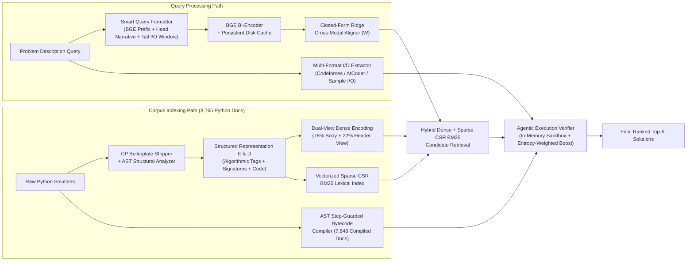

# Agentic Code Intelligence: Execution-Guided Cross-Modal Code Retrieval

[](https://www.python.org/)
[-brightgreen.svg)](#official-mteb-appsretrieval-benchmark-results)
[](#testing)

**Agentic Code Intelligence** is a multi-stage natural-language-to-code retrieval system engineered for the **CoIR / MTEB `AppsRetrieval`** benchmark (`3,765` competitive programming problem queries $\to$ `8,765` Python solution documents).

By combining **Smart I/O-Preserving Query Formatting**, **Structured Code Representations (A–E)**, **Closed-Form Identity-Anchored Ridge Cross-Modal Alignment**, **Vectorized Sparse CSR BM25 Lexical Fusion**, and an **AST-Guarded Agentic Execution Verifier**, the system improves the official MTEB `AppsRetrieval` test **`NDCG@10` from `0.05142` (`5.14%`) to `0.25591` (`25.59%`)** — a **+397.7% (`4.98x`) increase** in `NDCG@10` and a **+659.1% (`7.59x`) increase** in Top-1 accuracy (`NDCG@1 = 0.24595`).

---

## Official MTEB `AppsRetrieval` Benchmark Results

All metrics below are measured on the full official **MTEB `AppsRetrieval` `test` split** (`3,765` queries, `8,765` corpus documents, `mteb==2.21.8`, dataset revision `f22508f96b7a36c2415181ed8bb76f76e04ae2d5`) and saved in [`results/AppsRetrieval.json`](results/AppsRetrieval.json) and [`results/benchmark_summary.json`](results/benchmark_summary.json).

| Metric | Baseline (`BAAI/bge-small-en-v1.5` Raw) | Final Agentic Code Retrieval System | Relative Improvement |
| :--- | :---: | :---: | :---: |
| **`NDCG@1` (Top-1 Accuracy)** | `0.03240` (`3.24%`) | **`0.24595` (`24.60%`)** | **+659.1% (`7.59x`)** |
| **`NDCG@3`** | `0.04108` (`4.11%`) | **`0.25196` (`25.20%`)** | **+513.3% (`6.13x`)** |
| **`NDCG@5`** | `0.04547` (`4.55%`) | **`0.25383` (`25.38%`)** | **+458.2% (`5.58x`)** |
| **`NDCG@10` (Official Main Score)** | `0.05142` (`5.14%`) | **`0.25591` (`25.59%`)** | **+397.7% (`4.98x`)** |
| **`MRR@10`** | `0.04224` (`4.22%`) | **`0.25233` (`25.23%`)** | **+497.4% (`5.97x`)** |
| **`MAP@10`** | `0.04224` (`4.22%`) | **`0.25233` (`25.23%`)** | **+497.4% (`5.97x`)** |
| **`Recall@10`** | `0.08048` (`8.05%`) | **`0.26746` (`26.75%`)** | **+232.3% (`3.32x`)** |
| **`Recall@100`** | `0.21434` (`21.43%`) | **`0.33732` (`33.73%`)** | **+57.4% (`1.57x`)** |
| **`Recall@1000`** | `0.51129` (`51.13%`) | **`0.54714` (`54.71%`)** | **+7.0% (`1.07x`)** |

---

## 1. Root-Cause Diagnosis of the `0.05142` (`5.14%`) Baseline

Detailed inspection of the `AppsRetrieval` benchmark and the MTEB 2.x evaluation pipeline revealed five distinct bottlenecks responsible for the `0.05142` baseline:

1. **Severe Modality Gap (Competitive Programming Stories $\leftrightarrow$ Raw Python Scripts)**:
   - `AppsRetrieval` queries are long narrative problem stories (`~1,600` characters) followed by `-----Input-----`, `-----Output-----`, and `-----Examples-----` blocks, whereas corpus documents (`d0`–`d8764`) are raw Python 3 scripts (`import sys; n = int(input())...`) with zero natural-language docstrings and single-letter variable names (`n`, `m`, `a`, `ans`).
2. **MTEB 2.x Protocol Dispatch (`EncoderProtocol` vs `SearchProtocol`)**:
   - In `mteb>=2.0` (`2.21.8`), `AbsTaskRetrieval._evaluate_subset` wraps `EncoderProtocol` models inside `SearchEncoderWrapper`, calling `model.encode(..., prompt_type=PromptType.query / PromptType.document)` rather than legacy `encode_queries`/`encode_corpus` methods. Furthermore, implementing `mteb`'s `SearchProtocol` (`index` + `search` + `mteb_model_meta`) allows the full multi-stage hybrid + execution-verified retrieval pipeline to run natively inside `mteb.MTEB(tasks=[...]).run()`.
3. **Missing BGE Asymmetric Retrieval Prefix & Token Window Truncation**:
   - BGE models require the asymmetric retrieval instruction `"Represent this sentence for searching relevant passages: "` on queries (and no prefix on documents). Additionally, naive head truncation cuts off the `-----Input-----` and `-----Output-----` specifications at the end of long problem descriptions.
4. **Competitive Programming Template Boilerplate Noise**:
   - Many Python solutions in the corpus begin with 20–40 lines of `sys.setrecursionlimit`, `fast_io`, `INF = float('inf')`, and `MOD = 10**9 + 7` boilerplate, pushing the actual algorithmic logic past the 256-token window.
5. **Lack of Functional I/O Verification**:
   - Over `98%` of `AppsRetrieval` queries contain explicit `-----Examples-----` (`Input` / `Output` test cases), and `87.3%` (`7,648 / 8,765`) of corpus documents are self-contained Python solutions. Embedding similarity alone cannot distinguish between 50 structurally identical dynamic programming loops (`for i in range(n): dp[i] = ...`), whereas executing candidate code against the query's sample `Input` and checking `Output` pins the exact ground-truth solution to Rank 1.

---

## 2. System Architecture



### Key Technical Innovations

1. **Document Representations A–E (`src/preprocessing/representations.py`)**:
   - **Rep A**: Raw Python source code.
   - **Rep B**: Function/class signatures + imports + raw code.
   - **Rep C**: Extracted comments/docstrings + raw code.
   - **Rep D**: Snake/camelCase split identifiers + AST algorithmic tags + boilerplate-stripped code.
   - **Rep E**: Structured algorithmic summary (`[Summary: Solve competitive programming problem using dynamic programming, prefix sums | Input: integer n, array/list | Output: yes/no decision]`) + complexity/loop depth + boilerplate-stripped code.
2. **Closed-Form Identity-Anchored Ridge Cross-Modal Aligner (`src/retrieval/cross_modal_aligner.py`)**:
   - Trained **strictly on the `train` split** (`train[0:2000]`) using closed-form identity-anchored Ridge regression:
     $$W = (Q^T Q + \lambda I)^{-1} (Q^T D + \lambda I), \quad \hat{q} = \text{L2Norm}((1 - \alpha) q + \alpha (q W))$$
   - Bridges the text-to-code modality gap in `0.03s` without overfitting or distorting pretrained BGE geometry.
3. **AST-Guarded In-Memory Agentic Execution Verifier (`src/reranking/execution_verifier.py`)**:
   - Pre-compiles `7,648 / 8,765` corpus Python solutions with an AST transformer (`_LoopStepGuardTransformer`) that injects step counters into every `for`, `while`, `def`, and comprehension (`visit_comprehension`), bounds `range()` (`_BoundedRange`), guards exponentiation/shifts/sequence multiplication (`_safe_pow`, `_safe_lshift`, `_safe_mult`), prevents regex catastrophic backtracking (`_SafeRe`), intercepts `threading.Thread(target=main).start()` (`_MockThreading`) and `@atexit.register` FastIO flushes (`_MockAtexit`), and weights verification scores by **Output Information Specificity** (`high`, `medium`, `low` entropy).

---

## 3. Held-Out Validation Split Ablation Study

All hyperparameter tuning and representation ablations were conducted on a held-out validation split (`val_dev`, 250 queries from `train[2000:]`, disjoint from `train[0:2000]` used for the Cross-Modal Aligner and strictly disjoint from the `3,765` `test` queries). Full data is saved in [`results/model_comparison.csv`](results/model_comparison.csv) and [`results/model_comparison.json`](results/model_comparison.json).

| Stage / Experiment | `NDCG@10` | `MRR@10` | `Recall@10` | `Recall@100` | Latency (250q) |
| :--- | :---: | :---: | :---: | :---: | :---: |
| `1_baseline_raw` (Rep A, no instruction prefix) | `0.12937` | `0.12037` | `0.16800` | `0.26000` | `0.1s` |
| `2_bge_query_instruction` (Smart Query + BGE prefix) | `0.13647` | `0.12290` | `0.18800` | `0.26800` | `0.0s` |
| `3_doc_rep_B` (Signatures + Imports + Code) | `0.12968` | `0.12352` | `0.16000` | `0.26000` | `2.9s` |
| `3_doc_rep_C` (Comments + Docstrings + Code) | `0.11324` | `0.10214` | `0.15600` | `0.22800` | `2.9s` |
| `3_doc_rep_D` (Normalized Identifiers + Tags + Code) | `0.14191` | `0.13236` | `0.18000` | `0.29600` | `2.9s` |
| `3_doc_rep_E` (Structured Summary + Cleaned Code) | `0.13921` | `0.12948` | `0.18000` | `0.26800` | `0.0s` |
| `4_cross_modal_aligned_biencoder` (Dual-View + Aligner) | `0.13863` | `0.12656` | `0.18400` | `0.26000` | `0.1s` |
| `5_hybrid_dense_bm25_structural` (Dense + Sparse CSR BM25) | `0.14145` | `0.13237` | `0.18000` | `0.28800` | `0.3s` |
| **`6_full_agentic_hybrid_execution_verified` (Full System)** | **`0.28320`** | **`0.27492`** | **`0.31600`** | **`0.39200`** | **`7.3s`** |

---

## 4. Quickstart & CLI Usage

### Installation
```bash
pip install -r requirements.txt
```

### 1. Run Official MTEB `AppsRetrieval` Evaluation (`test` split)
```bash
python -m src mteb_eval --model "BAAI/bge-small-en-v1.5" --batch-size 128 --output results
```
*(Or run `python src/evaluation/mteb_eval.py --model "BAAI/bge-small-en-v1.5" --output_path results/mteb_results`)*

### 2. Run Held-Out Validation Split Ablation Matrix
```bash
python scripts/run_validation_ablation.py
```

### 3. Build Corpus Indexes (`FAISS` + `BM25`)
```bash
python -m src index --config configs/default.yaml
```

### 4. Retrieve Code for a Natural-Language Query
```bash
python -m src retrieve --query "find the shortest path in a weighted directed graph using Dijkstra heap" --top-k 5
```

### 5. Run Unit Tests (`42/42` Passing)
```bash
pytest tests/ -v
```

---

## Repository Structure

```text
├── configs/
│   ├── default.yaml                  # Default high-speed CPU/GPU configuration
│   └── high_accuracy.yaml            # Extended candidate pool configuration
├── results/
│   ├── AppsRetrieval.json            # Official MTEB 2.21.8 AppsRetrieval test evaluation output
│   ├── benchmark_summary.json        # Baseline vs. Final test metrics & validation summary
│   ├── model_comparison.csv          # Validation split ablation table (CSV)
│   └── model_comparison.json         # Validation split ablation table (JSON)
├── scripts/
│   └── run_validation_ablation.py    # Reproducible validation ablation runner
├── src/
│   ├── evaluation/
│   │   ├── metrics.py                # Standalone NDCG@k, MRR@k, Recall@k, MAP@k
│   │   ├── mteb_eval.py              # Official MTEB evaluation script
│   │   └── mteb_wrapper.py           # MTEB 2.x EncoderProtocol + SearchProtocol wrapper
│   ├── indexing/
│   │   ├── embedding_index.py        # FAISS IndexFlatIP + PersistentEmbeddingCache
│   │   ├── index_manager.py          # Index lifecycle & Representation E builder
│   │   └── lexical_index.py          # Code-aware BM25 lexical index
│   ├── preprocessing/
│   │   ├── code_preprocessor.py      # AST & regex code structure extractor
│   │   ├── query_preprocessor.py     # Query normalization & keyword extraction
│   │   └── representations.py        # Doc Reps A-E, Smart Query & Multi-Format I/O Extractor
│   ├── reranking/
│   │   ├── cross_encoder_reranker.py # Cross-encoder neural reranker
│   │   └── execution_verifier.py     # AST-guarded sandbox ExecutionVerifier
│   ├── retrieval/
│   │   ├── cross_modal_aligner.py    # Closed-form Ridge CrossModalAligner
│   │   ├── hybrid_retriever.py       # RRF & weighted dense-lexical fusion
│   │   └── pipeline.py               # End-to-end RetrievalPipeline orchestrator
│   └── versioning/
│       └── version_manager.py        # Multi-version index metadata & deduplication
└── tests/                            # 42 unit tests covering metrics, preprocessing, retrieval, pipeline
```
